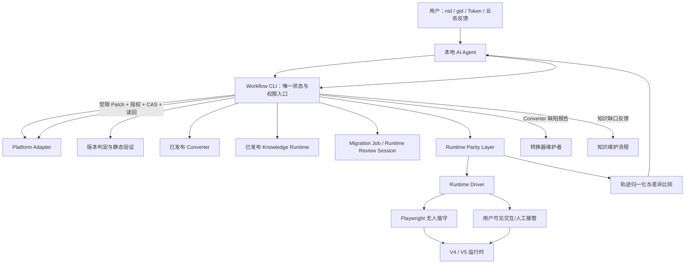
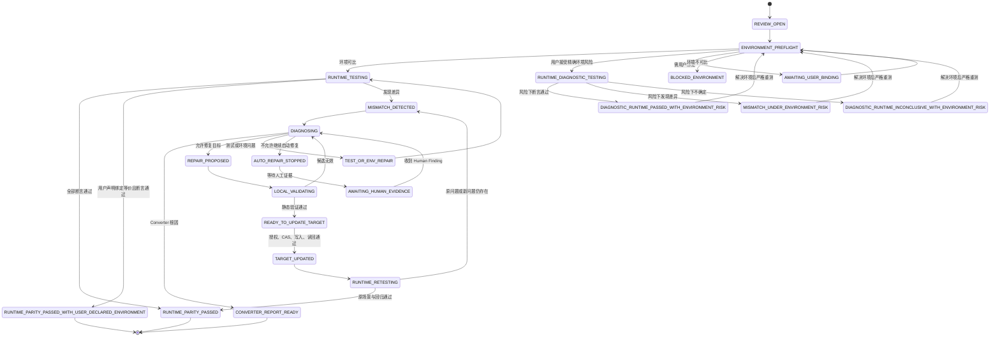
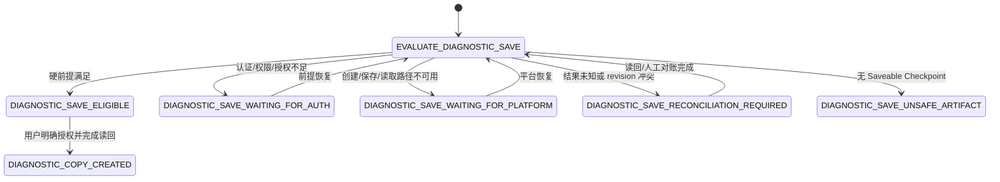
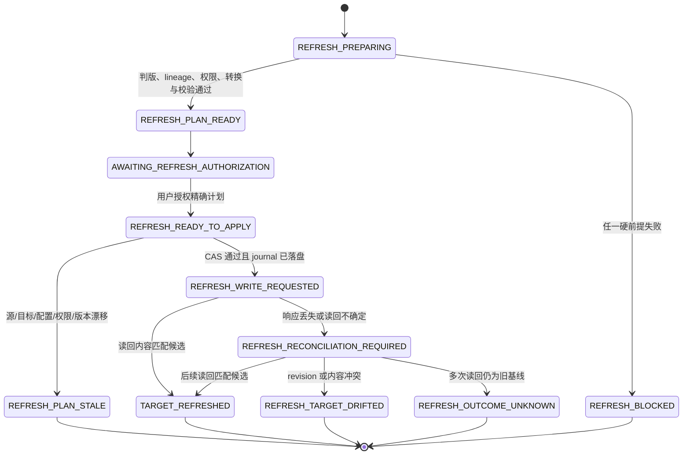

# V4→V5 工作流：运行时验证、问题诊断与 AI 修复设计

> 状态：阶段 0–13 已公开实现于签名稳定版 Workflow `0.12.1`，包括 Agent 自主业务面逐项对账、独立覆盖状态及用户授权的有副作用写后验证。执行、语义诊断、测试动作与业务判断仍交给本地 Agent；Workflow 保留受管证据、诊断政策、Patch 验证、预算、CAS、写后回读和审计。兼容 Converter `1.2.6` 与 Knowledge Runtime `0.1.6`，Agent protocol 仍为 9。
> 初稿：2026-08-12；本次修订：2026-08-21
> 适用项目：`ivx-v4-v5-migration` 及其独立分发的 Workflow、Agent 适配器和知识运行时
> 不修改：`tov5parser` 的转换规则；转换器继续由维护者在独立仓库中维护

## 1. 文档目的

本文把近期关于工作流优化的讨论收敛成一套可按阶段实施的设计，重点解决两个目标：

1. V4 转成 V5 并创建目标案例后，在用户本地由 AI Agent 对 V4/V5 进行运行时对照测试；发现差异时，区分转换器缺陷、源案例问题、目标案例局部问题、测试问题、环境配置问题、平台运行时问题和知识缺口。
2. 转换器缺陷只生成可交给维护者的报告，不由工作流修改转换器；允许自动修复的问题由 AI 在严格边界内修复 V5 目标案例、重新保存并复测，直到通过、预算耗尽或触发安全停止条件。
3. 在不破坏既有 Job/Review 审计链的前提下，明确区分“继续原操作”“再创建一个独立 V5”和“用当前 V4 完整刷新既有 V5 目标”三种用户意图。

同时，本文定义 Workflow 如何消费、锁定和检索独立发布的 Knowledge Runtime；知识内容如何从维护者资料生成和发布不属于 Workflow 的职责。

本文同时记录已确认的设计与逐阶段实现结果。Converter 仍由独立仓库维护；Workflow 不修改其转换规则。

## 2. 已确认的总体方向

### 2.1 职责分离

| 层 | 职责 | 明确不做 |
|---|---|---|
| Converter | 把输入 V4 JSON 确定性地转换为 V5 JSON，并输出转换过程诊断 | 不负责平台权限、运行时测试、AI 修复或另存流程 |
| Workflow CLI | 判版、拉取案例、锁定版本、调用 Converter、静态验证、状态管理、平台读写、恢复、审计与安全策略 | 不实现具体转换规则，不接受 Agent 绕过它直接写目标案例 |
| Runtime Parity Layer | 执行/接收场景、采集 V4/V5 行为轨迹、归一化并比较 | 不因一张截图不同就直接判定 Converter 有错 |
| Knowledge Runtime | 提供锁版规则、证据等级、适用范围、例外和修复许可 | 不直接运行转换，不以叙述性文档自动授权修改案例 |
| Local AI Agent | 在用户本地选择测试场景、解释证据、提出分类与受限修复建议，并通过 CLI 提交 | 不读取 Token，不直接修改 Converter，不直接调用平台写接口 |
| 用户 | 提供 Token、案例标识、必要的业务预期、写入授权和人工定位结果 | 不需要手工拼接工作流命令或直接编辑 Job 文件 |

### 2.2 Converter 的边界

- Converter 始终是独立仓库、独立版本、独立 Release 和独立签名更新通道。
- 其他用户只能安装/更新已发布 Converter，不能通过 Workflow 自动修改其转换逻辑。
- 一旦问题归因为 `CONVERTER`，工作流停止对该问题簇的 AI 修改，生成最小复现报告并提示用户交给维护者。
- Converter 问题通常只影响局部，因此不阻止用户得到一个可在编辑器中打开的 V5 诊断副本。现有“带已知问题另存”能力继续保留，但结果状态必须是 `DIAGNOSTIC_COPY_CREATED`，不能伪装成转换成功。

### 2.3 AI 和数据所在位置

- AI 推理发生在用户本地的 Codex、Claude Code 或以后支持的本地 Agent 中。
- Workflow CLI 是状态和写入权限的唯一权威；聊天记录不是工作流状态来源。
- Token 只由 Launcher/CLI 的安全输入和 Platform Adapter 在内存中使用，不进入 Agent 上下文、命令参数、Job、日志、诊断报告或知识反馈包。
- 源/目标案例 JSON 以及用户输入都按“不可信数据”处理，不能把其中的文本当成工作流指令。

### 2.4 Job 保存位置

- 完整 Job 继续保存在私有目录 `~/.ivx-v4-v5/jobs/<jobId>/`，不改为默认写入用户当前项目。
- 用户当前目录如果需要关联，只写入 `.ivx-migration/` 下的轻量引用，且默认被 Git 忽略；引用只包含 `jobId`、`nid/gid` 和摘要状态。
- 运行时轨迹可能包含业务数据、截图和网络摘要，更不应默认进入任意源码仓库。

## 3. 改造启动时的能力与目标差距（历史基线）

本节冻结的是 2026-08-12 启动本轮改造时的基线，用于解释后续阶段为什么存在，不代表当前实现状态。当前完成情况以第 17–20 节的实现记录、验收结果和发布状态为准。

### 3.1 改造前已经具备

- 使用用户自己的 Token 获取其有权参与的案例，并分别检查读取权限和另存权限。
- 根据平台元数据和 JSON 物理特征判断 V4、V5、歧义或不支持格式。
- 锁定 Workflow/Converter 版本，调用 Converter 并保存 V4、V5 和结构化诊断。
- 静态验证目标 JSON 的根结构、版本、节点 ID/引用、AST、`jsfn` 等问题。
- 对分类为 `SOURCE` 的有限问题应用受约束 RFC 6902 Patch，再重新验证。
- 对正常结果进行可恢复 V5 另存、`workId` 并发检查、写后读取和内容校验。
- 改造启动时的后期基础实现已把诊断副本改造成“问题类别不否决另存，写入硬前提独立判定”：所有受支持分类均可评估，平台、认证、权限、修订和写结果门禁仍单独强制执行。
- Workflow、Converter 和 Agent 适配器通过签名 Release 分发与更新。

### 3.2 改造前尚未具备（现已补齐）

- 没有 V4/V5 运行时场景、行为轨迹、归一化和等价比较协议。
- 没有把配置、预览域名/路径、外部依赖等环境差异作为运行时判断的前置门槛。
- 当前问题分类只有 `owner`，混合了“根因是谁”“谁负责”“该修哪里”三个维度。
- 当前 Migration Job 在另存后终结，不能表达可重开的运行时审查、人工发现和多轮修复。
- 没有目标案例后续更新的并发控制、人工编辑接纳和每轮读回验证链。
- 没有独立、签名、锁版的 V4/V5 演进知识运行时。
- 没有按问题簇计数的 AI 修复预算、案例级目标写入预算和振荡检测。
- 当前问题分类、自动修复决定和诊断另存决定仍有耦合，无法表达“停止修复但仍可创建 V5 诊断案例”。

## 4. 领域模型与术语

这些术语已经同步到仓库 `CONTEXT.md`，并应成为后续 Schema、CLI 和 Agent 说明的统一语言。

### 4.1 核心对象

| 术语 | 定义 |
|---|---|
| Migration Job | 从源案例判版、转换、静态验证到首次创建 V5 目标案例的不可变审计主记录 |
| Runtime Review Session | 依附于一个 Migration Job 和一个目标 V5 案例、可暂停和重开的运行时审查会话 |
| Runtime Scenario | 一组前置条件、用户动作、预期观察点和清理步骤；同一场景分别在 V4/V5 执行 |
| Behavior Trace | 一次场景执行产生的原始（尚未归一化）行为记录，包括关键 UI、状态、事件、请求摘要和错误 |
| Parity Assertion | 对 V4/V5 某项可观察行为是否等价的断言 |
| Runtime Mismatch | 某个 Parity Assertion 的实际 V4/V5 观察不一致；它是现象，不等于根因 |
| Issue | 静态验证或运行时比较产生的单项问题 |
| Issue Cluster | 具有同一根因、同一修复目标的一组 Issue；AI 修复预算按它计数 |
| Root Cause Classification | 基于证据对问题根因作出的分类结论 |
| Repair Target | 真正需要修改的对象，如 V5 案例、测试场景、环境绑定或知识规则 |
| Repair Attempt | 对一个 Issue Cluster 生成、通过本地政策校验并应用到工作副本的一次候选修复 |
| Repair Batch | 一次原子处理多个互不冲突 Issue Cluster 的修复集合 |
| Target Revision | V5 目标案例一次成功的平台写入和读回确认；一个 revision 可包含多个 Repair Attempt |
| Test Cycle | 基于一个确定的目标 revision 执行的一轮场景集合，不等同于修复次数 |
| Human Finding | 用户手动定位后提交的症状、复现、路径/BID 和判断；属于证据，不属于命令 |
| Environment Manifest | 源/目标运行环境的类型化、脱敏清单，不保存原始密钥值 |
| Knowledge Card | 从知识语料编译出的单条机器可检索规则，具有稳定 ID、证据、范围和修复许可 |
| Verification Closure | 某问题簇通过原场景和回归场景，或以明确阻塞原因停止的最终闭环记录 |
| Runtime Driver | 执行 Runtime Scenario 的运行器，可为 Playwright 无人值守模式或用户可见的交互模式 |
| Automatic Repair Decision | 针对一个 Issue Cluster，决定 AI 自动修复是允许、暂停还是停止；不决定能否另存 |
| Diagnostic Save Eligibility | 独立判断当前能否创建/保留 V5 诊断案例、需要等待什么前提或是否必须对账 |
| Saveable Checkpoint | 可序列化、平台可接收，且不处于半次 Patch 或已知回归中的 V5 候选版本 |
| Diagnostic Copy | 在仍有未解决问题时，为编辑态/运行态定位而创建或保留的 V5 案例；不等于转换成功 |
| Migration Continuation | 通过原 Job 和原 journal 恢复同一个未完成操作；不得创建新目标 |
| Additional V5 Creation | 用户明确要求基于当前 V4 新建一个独立 V5；创建新 Migration Job 和新 target nid，并保留全部旧历史 |
| Existing Target Refresh | 把当前 V4 完整转换后写入有可信 Workflow lineage 的既有 V5，保留 target nid，默认保留目标配置 |
| Refresh Job | 一次 Existing Target Refresh 的不可变审计记录，与 Migration Job、Runtime Review Session 分离 |
| Refresh Plan | 写入前锁定源/目标 revision、摘要、运行时版本、候选摘要、身份改写、配置政策和诊断的不可变计划 |
| Refresh Authorization | 绑定单个 Refresh Plan、目标基线、一次确认写入和有效期的用户授权 |
| Superseded Review | 目标经 Refresh 成功推进后保留为只读历史、已失去写权限的旧 Runtime Review Session |

### 4.2 两层生命周期

Migration Job 和 Runtime Review Session 必须分开：

- 首次成功或诊断另存后，Migration Job 仍保持终态，历史不被重写。
- 运行时测试、用户后续输入、人工编辑和多轮修复进入新的 Runtime Review Session。
- 同一个 Job 可以有多个审查会话，但同一目标 revision 同时只能有一个写入型会话。
- 聊天会话可以结束或换 Agent；只要 Job/Review Session 仍在，流程即可恢复。

## 5. 目标架构



### 5.1 新增模块

1. **Environment Parity**：读取源/目标设置和配置，按字段策略判断是否具备可比环境。
2. **Runtime Scenario/Trace**：定义场景、采集轨迹并对敏感值脱敏。
3. **Runtime Driver**：以 Playwright 执行无人值守场景，并为登录、复杂交互和人工判断提供用户可见的接管模式。
4. **Trace Normalizer/Comparator**：忽略允许变化的目标身份，保留真正影响业务的差异。
5. **Runtime Review Store**：保存会话、问题簇、预算、人工发现、目标 revision 和闭环状态。
6. **Diagnosis v2**：分离根因、责任方、修复目标、自动修复决定和诊断另存资格。
7. **Target Update Orchestrator**：在首次另存之后，受控更新目标 V5，执行并发检查、写入日志和读回验证。
8. **Knowledge Runtime Client**：安装、锁版、检索 Knowledge Card，生成知识反馈报告。

## 6. 端到端流程

### 6.1 初次迁移

1. Agent 检查 Launcher、Workflow、Converter、Agent 协议和 Knowledge Runtime 更新状态。
2. CLI 使用用户 Token 读取源元数据，验证读取/另存权限；`gid` 未提供时由平台元数据识别，不猜测。
3. CLI 判定版本：
   - V4：继续；
   - V5：返回 `SKIPPED_ALREADY_V5`；
   - 物理证据冲突：返回 `VERSION_AMBIGUOUS`；
   - 不支持产品线：返回 `UNSUPPORTED_V4_FORMAT`。
4. 锁定源 `workId`、Workflow、Converter、Knowledge Runtime 版本与摘要。
5. 调 Converter，保存原始 V4、转换 V5、Converter 诊断和静态验证结果。
6. 分类静态问题：
   - 无阻塞问题：正常另存；
   - 可安全修复的源/目标局部问题：本地修复并重新静态验证；
   - 任意根因分类：独立计算 Diagnostic Save Eligibility；满足写入硬前提并经用户授权时创建诊断副本；
   - 认证、服务器权限、平台写入路径或未知写入结果使硬前提暂时不成立时：进入等待/恢复/对账状态，而不是把该问题类别永久判为禁止另存。
7. 首次另存使用源 revision 检查、目标创建检查点、配置写入、最终 JSON 写入和读回验证。
8. Migration Job 结束；如已创建目标，可创建 Runtime Review Session。

### 6.2 运行时审查

1. 建立脱敏 Environment Manifest，先判断 V4/V5 是否可比。
2. 选择或生成 Runtime Scenario；高风险外部副作用场景需要用户单独确认。
3. 在固定源 revision 和目标 revision 上分别执行场景，采集 Behavior Trace。
4. 归一化允许变化的身份/随机项，生成 Parity Assertion 与 Runtime Mismatch。
5. AI 只读取与问题相关的最小轨迹、JSON 片段、静态诊断和 Knowledge Card，提出结构化分类。
6. CLI 校验分类：
   - Converter：生成报告，停止该问题簇自动修复；
   - 测试/环境：修测试或环境后重跑，不写目标案例；
   - 可修目标问题：生成受限 Patch，本地验证，通过授权后写入目标并读回；
   - 平台/知识/权限/未知：按对应阻塞政策处理。
7. 独立计算 Automatic Repair Decision 和 Diagnostic Save Eligibility；自动修复停止不影响已有目标保留，也不直接否决新的诊断另存。
8. 重新执行原场景和必要回归场景，直到通过、预算用尽、外部编辑冲突或触发自动修复停止。
9. 保存 Verification Closure，向用户汇报通过项、未通过项、目标 nid/revision、诊断另存状态和需维护者处理的报告。

## 7. 环境与配置等价

### 7.1 为什么不能直接完整复制 V4 配置

当前 Workflow 的普通另存行为与编辑器思路一致：以当前用户的默认工作配置为基础，只覆盖源案例的 `customVars`。这并不是完整复制源案例环境。

进一步核对 VxEditor41/VxServer 后可确认：

- 工作 JSON、work config、work settings/work info 是不同数据面。
- `domain`、`customDomain`、`previewDomain` 构成应由源继承的 Domain Binding；`path`、`previewPath`、`pubRoot`、`preRoot` 构成目标独占的 Target Route Allocation。
- VxServer 的另存逻辑会为目标重新生成唯一路径；Workflow 只能在目标创建后恢复源域名身份，不能把源路径覆盖回目标。
- 配置中存在密钥、私钥、客户端 secret、证书/keystore 密码等敏感类别，既不能盲目复制，也不能交给 AI 判断。

因此目标不是“字节级配置相同”，而是“业务语义所需的环境等价”。

### 7.2 字段政策注册表

每个已知字段必须归入以下一种策略；未知字段默认阻塞自动运行时归因，不能静默忽略：

| 策略 | 含义 | 例子 |
|---|---|---|
| `COPY_EXACT` | 允许按平台规则复制且语义必须相同 | 经审查的非敏感自定义显示配置 |
| `REMAP_FOR_TARGET` | 必须为目标生成新值，并在比较时按身份映射归一化 | `nid`、`workId`、系统生成预览路径 |
| `USE_TARGET_BINDING` | 使用目标用户/目标组已有绑定 | 账号级资源、目标默认环境 |
| `REQUIRE_USER_BINDING` | 无法安全自动复制，要求用户为目标重新绑定 | 支付、OAuth、证书、外部账号密钥 |
| `REDACT_AND_COMPARE` | 只在可信代码内比较类型/存在性/等价标志，不持久化原值 | `customVars` 中的敏感值、secret 类字段 |
| `IGNORE_FOR_PARITY` | 已证明不影响当前场景语义，可从轨迹中忽略 | 请求 ID、时间戳、平台生成追踪号、保存配置预设名称 `/config/name` |

### 7.3 推荐的首版政策

- `customVars`：继续在 Platform Adapter 内存中按源语义写入目标；Job 只记录键名、类型、是否存在、是否一致等脱敏信息，原值不进入 AI 上下文。
- 域名与路径：另存时复制源 `domain`、`customDomain`、`previewDomain`，保留目标新生成的 `path`、`previewPath`、`pubRoot`、`preRoot`。通常在轨迹中只归一化 nid、workId 和已审查的目标路径映射；如果案例业务逻辑主动读取、拼接或比较 `location.host/path`，域名必须真实一致，路径差异也必须按场景审查，不能一概归一化。
- WorkInfo 路由投影：`workInfo.domain`、`workInfo.previewDomain` 在目标读取结果中可能省略；只有对应的 `settings.domain`、`settings.previewDomain` 在源、目标两侧均存在并通过字段政策比较时，才可将该投影缺省归一化。Settings 也缺失时仍然阻断。
- 预览禁用默认值：VxServer 只在 `workInfo.extra.preDisable === true` 时禁用预览，因此字段缺失与显式 `false` 语义等价；`true` 与缺失仍然阻断。Manifest 保留真实的 PRESENT/ABSENT，不伪造字段存在。
- 安全的展示/加载设置：建立明确 allowlist 后才复制；首版不得使用“复制所有未知键”。
- 密钥、证书、客户端 secret、账号资源：只报告缺失/不等价，要求用户在目标侧绑定；绝不输出原值。
- 外部 API、数据库、消息队列：记录逻辑绑定是否等价。可能产生真实副作用的测试默认禁止自动执行。
- 保存配置预设名称 `/config/name`：VxEditor 保存预设时可能把显示名称带入 work config，但 VxServer 运行时配置合同不读取该字段，因此显式忽略。该结论不扩展为“忽略所有非域名字段”；其他未知字段仍默认阻塞。

#### 7.3.1 Save As 域名配置检查点

普通另存、Additional V5 和诊断副本共用同一个 journaled checkpoint：

1. 在创建目标前，读取 revision-pinned V4 `settings` 并冻结 Domain Binding 及其摘要；
2. 创建 V5 后读取其 settings/work info，冻结 Target Route Allocation 及摘要；
3. 构造完整平台 payload：源域名字段 + 目标路径/root 字段；若当前目标已经精确匹配则不写；
4. 写前再次确认源域名和目标路径未漂移，调用一次窄化的 routing modify，再精确读回；
5. 请求响应丢失时只允许通过目标读回确认。未观察到精确结果时进入 `DOMAIN_ROUTING_RECONCILIATION_REQUIRED`，不得自动重放；
6. 若旧 journal 在该检查点引入前已经开始最终内容保存，则标为 `LEGACY_SKIPPED` 并沿用旧恢复语义，不在升级恢复途中插入额外平台写入。

Domain Binding 和 Target Route Allocation 只作为私有 Job 证据保存，不含 Token/Cookie。Agent 不直接调用 `getConfig`/`modify`，也不自行修补设置；它只消费 CLI 的确认、漂移或对账结论。该检查点不增加新的 Agent 授权或输入格式，因此 Agent protocol 保持 8。

### 7.4 环境门禁状态

| 状态 | 正常运行时对照 | 是否允许评价 Converter |
|---|---|---|
| `ENVIRONMENT_EQUIVALENT` | 允许 | 允许 |
| `NORMALIZED_EQUIVALENT` | 允许，报告列出归一化/用户声明项 | 允许 |
| `REQUIRES_USER_BINDING` | 默认停止；可另行授权风险诊断 | 不允许 |
| `BLOCKED_ENVIRONMENT` | 默认停止；可另行授权风险诊断 | 不允许 |

环境比较必须如实保留原状态。用户接受风险不是环境等价声明；即使风险下观察到 V4/V5 差异，也不能归因给 Converter。

### 7.5 用户接受风险后的诊断运行

当用户暂时无法完成目标绑定或消除已知环境差异，但希望先打开运行态定位问题时，可创建独立的私有 `environment-risk-acceptance`。它必须：

- 由用户明确确认，使用 `ACCEPT_ENVIRONMENT_RISK` 和目的 `DIAGNOSTIC_RUNTIME_ONLY`；
- 精确绑定 Review ID、源/目标 nid + workId、当前全部未解决字段路径和所选 Runtime Scenario ID；
- 创建后最长 8 小时有效，不能从 Agent 的一般“继续”指令静默推导；
- 不绕过认证、平台可用性、revision、浏览器登录、场景副作用授权或任何写入门禁。

运行时记录三种环境保证级别：`STRICT_EQUIVALENT`、`USER_DECLARED_EQUIVALENT` 和 `USER_ACCEPTED_RISK`。风险运行只产生：

- `DIAGNOSTIC_RUNTIME_PASSED_WITH_ENVIRONMENT_RISK`；
- `MISMATCH_UNDER_ENVIRONMENT_RISK`；
- `DIAGNOSTIC_RUNTIME_INCONCLUSIVE_WITH_ENVIRONMENT_RISK`。

这些结果不是严格运行时等价，也不进入 Diagnosis v2 候选、Converter 归因或自动目标修复。用户解决环境后可返回 Environment Preflight，重新执行严格对照。用户对目标绑定作出业务语义等价声明并通过对照时，单独使用 `RUNTIME_PARITY_PASSED_WITH_USER_DECLARED_ENVIRONMENT`，不得与风险接受混淆。修复后的目标复测必须使用等价环境，禁止依赖风险接受关闭 Repair Batch。

## 8. 运行时测试与行为比较

### 8.1 场景来源优先级

1. 用户提供或录制的真实关键路径。
2. 维护者发布的标准场景/组件回归场景。
3. 从案例事件和页面结构推导出的确定性场景。
4. AI 探索性场景。

AI 自行生成的场景可以发现问题，但没有明确预期时不能单独证明“修复正确”。如果案例没有可执行场景或可观察断言，最终只能标记 `STRUCTURALLY_VERIFIED` / `RUNTIME_NOT_TESTED`，不能宣称运行时等价。

### 8.2 场景结构

每个 Runtime Scenario 至少包含：

- `scenarioId`、版本和来源；
- 前置页面、账号/角色和数据准备；
- 可重复执行的动作序列；
- V4/V5 都可定位的语义目标，而不是易变化的 DOM 偶然位置；
- 观察点、允许差异和超时；
- 副作用等级：`READ_ONLY`、`REVERSIBLE`、`EXTERNAL_SIDE_EFFECT`；
- 清理/回滚步骤；
- 适用的 Knowledge Card ID。

### 8.3 Behavior Trace 内容

优先采集结构化证据：

- 页面/组件关键可见值；
- 变量、状态、路由和事件顺序；
- 服务调用名称、参数形态、返回状态和脱敏摘要；
- 网络请求方法、语义路径、状态码和脱敏 payload 形状；
- 控制台错误、未捕获异常和平台运行时错误；
- 关键节点截图。

截图用于辅助定位，不作为唯一判据。完整响应体、Token、Cookie、Authorization 和配置 secret 不得进入 Trace。

### 8.4 归一化原则

- 可归一化：源/目标 nid、workId、平台分配 host/path、时间戳、随机 ID、请求追踪号等身份差异。
- 不可归一化：业务代码实际读取并参与判断的域名/路径、不同的请求参数、事件是否触发、状态值、返回分支、错误等。
- 顺序敏感事件按部分顺序/因果关系比较；不得为消除差异随意排序全部事件。
- V4 是转换行为的主要参照，但不是绝对无错。如果 V4 本身失败或依赖失效，应归类为源/环境/平台问题，而不是强行让 V5 复刻错误。

### 8.5 执行方式：Playwright 无人值守为主，用户可见交互为补充

Playwright 应成为首版正式 Runtime Driver，而不是以后才考虑的可选项。两种执行模式实现相同的 Scenario/Trace 接口：

**无人值守模式**适用于可重复、可定位且副作用受控的场景。它自动打开 V4/V5、执行相同动作、等待稳定状态、采集控制台/异常/网络摘要/UI 观察、截图和 trace，并在目标修复后自动复测，直到通过或触发停止条件。

**用户可见交互模式**用于首次登录、验证码、复杂拖拽、地图/摄像头/文件系统、业务人员才能判断的结果，以及支付、通知、真实删除等外部副作用。用户可在可见浏览器中完成必要动作，再由同一 Trace 合同记录结果。

首版约束：

- AI 生成受限的声明式 Runtime Scenario，由 Workflow 校验后映射为 Playwright 操作；不允许每轮生成任意 JavaScript 直接执行。
- 无人值守至少覆盖页面加载、初始化、表单、跳转、条件显示、列表操作、组件方法和无真实副作用的服务调用。
- V4/V5 使用隔离浏览器上下文、相同场景和确定性数据；浏览器认证状态保存在用户私有区域，不进入 Agent、Job Trace 或报告。
- `OPEN_PAGE` 的 `$SUBJECT_URL` 是封闭的运行时占位符，分别解析为当前 V4/V5 revision-pinned 完整预览 URL；普通 `/path` 仍表示该预览 origin 下的固定绝对路径。这样同一场景不会误把两边都导航到平台首页。
- `READ_ONLY` 可无人值守；`REVERSIBLE` 需要可验证清理和会话授权；`EXTERNAL_SIDE_EFFECT` 默认转为用户可见模式或 mock/测试环境。
- Agent 探索可以发现问题，但没有稳定断言时不能独立证明运行时等价。
- 第一阶段让 Playwright 只产出差异报告，不自动写目标；重复性、脱敏和误报率验收后再接入 AI 修复闭环。
- Workflow 不依赖某一个 Agent 的聊天记忆、浏览器插件或私有工具格式，未来其他 Driver 也必须实现同一 Scenario/Trace 合同。

声明式场景应类似：

```json
{
  "scenarioId": "order-submit",
  "sideEffect": "READ_ONLY",
  "actions": [
    { "type": "openPage", "page": "订单页" },
    { "type": "click", "target": { "semanticId": "submitButton" } },
    { "type": "waitFor", "target": { "semanticId": "resultText" } }
  ],
  "assertions": [
    { "target": { "semanticId": "resultText" }, "compare": "V4_V5_EQUAL" }
  ]
}
```

无人值守认证不复用平台 API Token，也不让 Agent 接触 Cookie。需要登录时，CLI 首次启动用户可见的专用 Playwright 持久浏览器配置，用户自行完成登录；后续无人值守运行只复用该专用私有配置。配置位于用户私有应用目录、与 Job/Trace 分离，并按凭据处理；登录失效、验证码出现或站点要求重新认证时立即切换为用户可见模式，不能由 Agent 读取或伪造认证数据。

## 9. 问题分类 v2

### 9.1 为什么要替换单一 `owner`

“V4/V5 不一致”只是观察；“Converter 有错”是根因；“修改 V5 JSON”是修复目标；“交给维护者”是责任流向。当前一个 `owner` 字段无法同时表达这些关系，容易出现环境不一致却误报 Converter，或非 Converter 问题却修改了错误对象。

建议的分类记录至少包含：

```json
{
  "issueId": "...",
  "clusterId": "...",
  "cause": "TARGET_CASE",
  "responsibleParty": "WORKFLOW_AI",
  "repairTarget": "V5_ARTIFACT",
  "confidence": 0.91,
  "reason": "...",
  "evidenceRefs": ["..."],
  "knowledgeRuleIds": ["..."],
  "autoRepairAllowed": true
}
```

### 9.2 根因与处置矩阵

| `cause` | 含义 | 自动修复对象 | 诊断另存政策 | 默认动作 |
|---|---|---|---|---|
| `CONVERTER` | 可复现的通用转换规则错误 | 无 | 允许 | 生成维护者报告，停止该簇自动修复 |
| `SOURCE_DATA` | V4 源数据异常/歧义，但业务意图有唯一安全映射 | 仅目标 V5；不改原 V4 | 允许 | 受限修复目标并复测 |
| `TARGET_CASE` | 目标案例局部可修问题，不足以证明通用 Converter 缺陷 | 目标 V5 | 允许 | 受限修复目标并复测 |
| `TEST_HARNESS` | 场景、定位、等待条件或观察器错误 | 测试定义/驱动 | 允许 | 修测试后重跑，不写目标 |
| `ENVIRONMENT_CONFIGURATION` | 配置、域名、账号绑定或外部依赖不等价 | 环境/绑定 | 允许 | 修环境后重跑，不评价 Converter |
| `PLATFORM_RUNTIME` | V4/V5 共享平台或播放器运行时异常 | 无 | 允许；若另存控制面同时故障则等待恢复 | 报告平台问题并停止自动修复 |
| `KNOWLEDGE_GAP` | 现有规则不足或证据矛盾 | 知识反馈包 | 允许 | 不猜测修复，反馈维护者 |
| `AUTHORIZATION` | 权限/Token/用户授权不足 | 无 | 问题类别不永久禁止；硬前提恢复前等待 | 请求用户恢复认证、取得服务器权限或提供写入授权 |
| `UNKNOWN` | 证据不足，尚不能归因 | 无 | 允许显式诊断副本 | 保留证据并等待人工输入，不自动 Patch |

重要区别：所有根因分类都允许独立评估诊断另存，分类本身不构成否决。只有已明确归类且修复目标唯一的 `SOURCE_DATA`/`TARGET_CASE` 才允许 AI 自动 Patch；`UNKNOWN` 不能因为“不是已知 Converter 问题”就自动修改。`AUTHORIZATION` 也不能靠用户一句确认绕过服务器权限，只能在认证、权限或会话授权恢复后继续另存。

### 9.3 三个独立决定

每个问题簇必须分别得到三个决定，任何一个都不能由另一个隐式推导：

1. **Root Cause Classification**：问题因为什么发生。
2. **Automatic Repair Decision**：AI 是否可以继续为该问题簇尝试 Patch。
3. **Diagnostic Save Eligibility**：当前是否可以创建/保留 V5 诊断案例，或必须等待什么写入前提。

Automatic Repair Decision 使用：

| 状态 | 含义 |
|---|---|
| `AUTO_REPAIR_ALLOWED` | 当前问题簇仍满足自动修复条件和预算 |
| `AUTO_REPAIR_PAUSED` | 等待用户补充证据、追加预算或处理可恢复条件 |
| `AUTO_REPAIR_STOPPED` | 当前问题簇不再自动尝试 Patch；不影响诊断另存 |

Diagnostic Save Eligibility 使用：

| 状态 | 含义 |
|---|---|
| `DIAGNOSTIC_SAVE_ELIGIBLE` | 存在 Saveable Checkpoint，所有硬前提满足，可在用户授权后创建或保留诊断副本 |
| `DIAGNOSTIC_SAVE_WAITING_FOR_AUTH` | Token、服务器权限或本次写入授权尚未满足；恢复后可继续 |
| `DIAGNOSTIC_SAVE_WAITING_FOR_PLATFORM` | 平台创建/保存/读取路径当前不可用；恢复后继续，不永久否决 |
| `DIAGNOSTIC_SAVE_RECONCILIATION_REQUIRED` | 之前写入结果未知或 revision 冲突，必须先读回/人工对账 |
| `DIAGNOSTIC_SAVE_UNSAFE_ARTIFACT` | 当前没有可序列化、平台可接收且不处于半次修复中的 Saveable Checkpoint |

诊断另存的硬前提是：有效认证、服务器允许的目标写权限、明确的本次用户授权、可用或可恢复的平台写入路径、源/目标 revision 安全、没有未知写入结果，以及一个 Saveable Checkpoint。它们是现实和安全约束，不是问题类别白名单。

### 9.4 Converter 缺陷报告

报告应可直接发给转换器维护者，默认只包含最小必要信息：

- Workflow、Converter、Knowledge Runtime 的版本和哈希；
- 源 nid/gid、源 `workId` 和目标 nid/revision；
- 问题场景、归一化后的 V4/V5 行为差异；
- 最小 V4 输入片段、Converter 输出片段、期望 V5 形态；
- JSON Path、BID/节点 ID、规则 ID 和证据来源；
- 稳定复现步骤、影响范围和置信度；
- 对应静态诊断及是否在其他案例复现。

默认不包含 Token、Cookie、完整配置、完整业务响应或整案 JSON。若维护者需要整案，必须由用户另行确认安全交付方式。

## 10. 外部 Knowledge Runtime 消费

### 10.1 信任边界

Workflow 的知识职责从 `VisualLogic-VLCode/ivx-v4-v5-knowledge` 已发布的签名稳定通道和不可变 GitHub Release 开始。它不读取、不定位也不理解任何知识维护源、工作树、构建脚本或同步过程。

```text
ivx-v4-v5-knowledge 签名稳定通道
        │
        │ 版本描述符 / 兼容范围 / SHA-256 / 签名
        ▼
不可变 Knowledge Release
        │
        │ 下载 / 校验 / 原子安装
        ▼
本地已激活 Knowledge Runtime
        │
        │ 有限检索 / Job 锁版 / 回滚
        ▼
Workflow 与本地 Agent
```

Workflow、Launcher 和 Agent 适配器明确不包含：

- 知识维护源的仓库名、本机路径、分支、commit 比较或工作树状态；
- 知识同步、构建、导出、脱敏、隐私扫描、版本建议或 Release 发布程序；
- 未发布候选、原始研究语料、完整案例证据或维护者内部文档；
- 公开知识仓库的 commit、push、tag、Release 或 stable channel 写权限。

### 10.2 已安装运行时布局

Workflow 只处理发布包中的稳定公共协议：

```text
Knowledge Runtime
├── manifest.json          # 版本、schema、兼容范围和文件哈希
├── rules.jsonl            # 结构化 Knowledge Card
├── index/                 # 本地只读检索索引
├── books/                 # 经审查的用户版读本
├── vocab/                 # 锁版组件/方法/AST 词表摘要
└── provenance.json        # 规则与已公开证据的映射
```

发布包内部如何生成属于知识发布者；Workflow 仅验证 manifest、签名、哈希、协议版本和兼容范围。

### 10.3 Knowledge Card 最小消费字段

- 稳定 `ruleId`、规则版本和主题；
- 适用的 V4/V5/Converter/组件词表版本范围；
- V4 源模式、V5 目标不变量和例外条件；
- 已公开的证据类型、证据等级和 provenance 标识；
- `CONFIRMED`、`PENDING_RUNTIME`、`ADVISORY_ONLY` 或 `EXECUTABLE_REPAIR` 状态；
- 是否允许仅诊断、静态校验、自动修复或必须人工确认；
- Knowledge Runtime 版本、内容摘要和 Schema 版本。

只有发布包中已标为 `EXECUTABLE_REPAIR` 且同时通过 Workflow Patch policy 的规则，才可能参与自动修复授权；叙述性章节和 `PENDING_RUNTIME` 规则只能作为解释证据。

### 10.4 检索与锁版

- 每次 Job/Review Session 固定 Knowledge Runtime 版本、内容摘要和实际使用的 `ruleId`。
- 检索由 JSON Path、节点 type、AST op、组件方法、诊断码、运行时错误和行为差异共同限界，只返回最相关的少量卡片。
- Knowledge Runtime 是本地只读依赖；Agent 不能修改已安装规则或绕过 Workflow 直接加载外部文档。
- Workflow/Converter/Knowledge 三者各自发布，Knowledge Release manifest 声明其协议和兼容范围。

### 10.5 更新、回滚与反馈

- `setup`/`update check` 只读取配置的签名稳定通道，不读取知识仓库 `main` 分支、Raw 文件或未发布候选。
- 安装前验证 Ed25519 签名、不可变 Release、SHA-256、包内 manifest、Schema 和 Workflow/Converter 兼容矩阵；失败时不改变当前激活版本。
- `update apply` 使用临时目录校验后原子激活，保留历史可信版本用于回滚。
- 新 Job 使用当前已激活版本；进行中的 Job/Review Session 不静默换版。用户选择升级既有案例时创建新知识基线，不重写旧审计记录。
- 运行时发现知识可能有误时，Workflow 生成脱敏 Knowledge Feedback Report：规则 ID、最小复现、当前规则、实际证据和建议状态变化；它不直接修改或发布知识。

### 10.6 发布者与消费者接口

知识发布者向 Workflow 提供的唯一接口是签名通道与不可变 Release。通道描述符至少包含 Knowledge Runtime 版本、Release 资产地址、SHA-256、Schema 版本、兼容的 Workflow/Converter/Agent protocol 范围、撤销状态和签名元数据。

Workflow 只实现以下消费者动作：

1. 检查是否存在兼容且未撤销的新版本；
2. 下载并验证指定不可变 Release；
3. 原子安装、激活、列出和回滚本地 Knowledge Runtime；
4. 把实际版本、哈希和 `ruleId` 写入 Job/Review Session 审计记录；
5. 对 Agent 暴露有限检索结果和脱敏反馈报告入口。

知识内容的来源、同步、构建、审查、版本判定和公开发布由 `ivx-v4-v5-knowledge` 自己维护，既不是 Workflow 实现阶段，也不随 Workflow 包分发。

## 11. AI 自动修复政策

### 11.1 可修改范围

AI 不直接写平台，也不生成任意脚本修改案例。它只能提交结构化分类和 RFC 6902 Patch，由 CLI 执行以下检查：

- 仅允许 `add`、`remove`、`replace`；
- 仅允许目标 V5 的 `/case`、`/stage`、`/server` 子路径；
- 禁止修改 nid/gid/uid/eid/workId/modDbId、Token、secret、password、Cookie、Authorization 等身份或敏感字段；
- 限制操作数量、单值大小和整体 diff；
- 必须关联 Issue Cluster、证据和 Knowledge Card；
- 必须先在本地工作副本通过静态验证；
- 写入前核对目标 `workId`，写入后读回内容和新 revision；
- 必须重跑原失败场景和受影响的回归场景。

### 11.2 “3+2”到底按什么计数

`3+2` 按 **一个 Issue Cluster** 计数，不是一个案例所有问题合计五次：

- 前 3 次：在用户已开启本次运行时修复会话的前提下，允许自动尝试。
- 后 2 次：同一问题簇前三次仍未闭环时，暂停并说明原因；用户明确授权后最多再尝试两次。
- 新发现且根因独立的问题簇拥有自己的 `3+2` 预算。
- 多个互不冲突的问题簇应合并成一个 Repair Batch 和一次目标写入，减少平台 revision。

因此复杂案例即使有多个独立问题，也不是总共只能改五次；限制的目的在于阻止 AI 围绕同一个根因反复猜测。

### 11.3 为什么默认前三次合理

这是首版安全默认值，不是永久经验结论，理由是：

1. 一个边界清楚、证据充分的问题，通常第一次修主因，第二次补关联，第三次处理遗漏或回归；超过三次仍不收敛，根因或修复范围很可能判断错了。
2. 连续修改同一局部会增加振荡风险，例如 A→B→A，继续自动尝试的收益快速下降。
3. 每次平台写入都生成真实目标 revision，可能触发平台副作用；不能把大模型“再试一次”当成无成本操作。
4. 三次后暂停可以让用户提供人工定位结果，而不是直接终止案例；额外两次为已获得新证据的情况保留空间。
5. 该值后续应根据受控试点的成功率、P90/P95 修复次数、回退率和误修改率调整，而不是凭感觉无限放宽。

### 11.4 案例级写入预算

问题簇预算之外，再设置 Review Session 的目标写入预算：

- 默认最多 **10 次成功的 Target Revision**；
- 达到后暂停，用户可一次性追加 **5 次**；
- 该上限是平台写入安全阀，不是问题数量上限；批处理可让多个问题共享一次 revision；
- 试点数据证明复杂案例稳定需要更多时，再调整默认值。

不计入 Target Revision 的动作：纯分析、读取、场景重跑、被政策拒绝的 Patch、未写平台的本地静态修复、测试驱动修复、环境修复、网络重试和 Converter/知识报告生成。

Repair Attempt 只在候选 Patch 已通过政策校验并应用到工作副本时计数。平台写入成功且读回确认后才计 Target Revision。

### 11.5 即使有剩余预算也必须停止自动修复

- 根因变为 `CONVERTER`、`PLATFORM_RUNTIME`、`KNOWLEDGE_GAP`、`AUTHORIZATION` 或 `UNKNOWN`；
- 环境不再等价；
- 修复引入新的高严重度静态/运行时回归；
- 检测到振荡、重复 Patch、范围持续扩大或置信度下降；
- 目标案例被外部编辑且无法安全接纳为新基线；
- Patch 需要触及受保护身份、密钥、Converter 或源 V4；
- 场景具有未授权的真实外部副作用。

这里的“停止”仅指当前 Issue Cluster 进入 `AUTO_REPAIR_STOPPED`：AI 不再继续猜测 Patch，剩余预算冻结或失效，并生成相应报告。它不删除已有 V5、不阻止打开编辑器，也不直接改变 Diagnostic Save Eligibility。

### 11.6 自动修复停止后的诊断另存

自动修复停止后，用户仍可选择：

1. 创建或保留当前 V5 诊断副本；
2. 打开编辑器定位编辑态或运行态问题；
3. 提交 Human Finding；
4. 手动修改目标后，将新 revision 显式接纳为审查基线；
5. 修复认证、权限、环境或平台可用性后继续测试/另存；
6. 把 Converter/Knowledge/Platform 报告交给对应维护者；
7. 在新 Converter 或 Knowledge Runtime 发布后创建新的 Review Session。

若还没有目标案例，Workflow 必须独立计算 Diagnostic Save Eligibility。满足硬前提且用户授权时，无论根因是 `CONVERTER`、`PLATFORM_RUNTIME`、`KNOWLEDGE_GAP`、`AUTHORIZATION`（已恢复）还是 `UNKNOWN`，均可创建 `DIAGNOSTIC_COPY_CREATED`。

用于另存的候选必须由用户在以下 Saveable Checkpoint 中选择或接受 Workflow 默认推荐：

- 原始 Converter 输出；
- 最后一次通过最低静态安全检查的候选；
- 已在平台写入并读回确认的最新目标 revision。

处于半次 Patch、已产生静态/运行时回归或无法序列化的平台临时工作副本不能直接另存。若目标已经存在，则默认保留现有诊断案例，不为同一目的重复创建。

## 12. 用户后续输入与人工编辑

### 12.1 用户可以继续提供定位结果

初次转换和 AI 测试结束后，用户可以在同一任务或新任务中继续说：

- 哪个页面/动作不一致；
- V4 与 V5 的具体表现；
- 相关 JSON Path、节点 ID、BID 或事件；
- 自己认为的根因；
- 是否已经手工编辑目标 V5。

Agent 应定位关联 Job/Review Session，并通过 CLI 创建 Human Finding。用户文字只是证据，不能直接变成平台写入指令。

### 12.2 Human Finding 建议字段

- `findingId`、提交时间和关联 review/issue/cluster；
- 症状、复现步骤、V4 观察、V5 观察；
- JSON Path、BID/节点 ID、截图/日志引用；
- 用户建议原因和置信说明；
- `targetManuallyEdited` 标记及用户提供的 revision 信息；
- 是否请求重跑、重新分类、生成 Converter 报告或尝试修复。

### 12.3 手工编辑目标案例

如果用户在编辑器中修改了 V5：

1. CLI 读取最新目标 `workId`，发现它不同于 Workflow 最后写入的 revision。
2. 自动写入暂停，状态进入 `TARGET_EXTERNALLY_MODIFIED`。
3. 拉取最新目标，与 Workflow 基线做受限 diff；不覆盖用户修改。
4. 用户明确同意把该 revision 作为新基线后，重新静态验证。
5. 通过后重跑受影响场景；用户修改不计 AI Repair Attempt，但计为外部 Target Revision。

这使用户可以亲自定位和修改，同时保持审计链和并发安全。

## 13. 状态机设计

### 13.1 Migration Job

现有首次迁移状态机原则上保留。正常结果终结为 `SUCCEEDED`，带已知问题另存终结为 `DIAGNOSTIC_COPY_CREATED`，无写入测试终结为 `DRY_RUN_SUCCEEDED`。终态不因后续运行时审查而改写。

### 13.2 Runtime Review Session

创建平台 Review 前必须读取当前完整源案例，并与 Migration Job 的不可变 V4 输入计算相同的规范化内容摘要。若 `workId` 在 Save As 后推进但摘要相同，Workflow 可把新 Review 固定到当前 revision，并写入包含原/新 workId、期望/当前摘要和原因的私有协调记录；若 Review 已由旧版创建但仍是没有任何环境证据的 `REVIEW_OPEN`，首次环境检查可执行同一协调。摘要不同、读取不完整、已有环境/运行时证据或活动 cycle 时必须阻断，保留既有 target，且不得通过新 Job 或重复 Save As 绕过。



建议的摘要状态还包括：

- `RUNTIME_NOT_TESTED`
- `RUNTIME_MISMATCH_CLASSIFIED`
- `BLOCKED_CONVERTER_DEFECT`
- `BLOCKED_PLATFORM_RUNTIME`
- `RUNTIME_REPAIR_EXHAUSTED`
- `AWAITING_HUMAN_EVIDENCE`
- `TARGET_EXTERNALLY_MODIFIED`
- `RUNTIME_PARITY_PASSED`
- `RUNTIME_PARITY_PASSED_WITH_USER_DECLARED_ENVIRONMENT`
- `DIAGNOSTIC_RUNTIME_PASSED_WITH_ENVIRONMENT_RISK`
- `MISMATCH_UNDER_ENVIRONMENT_RISK`
- `DIAGNOSTIC_RUNTIME_INCONCLUSIVE_WITH_ENVIRONMENT_RISK`

### 13.3 诊断另存是与修复状态正交的决定

上面的状态机描述运行时审查和修复，不用它隐式决定能否另存。任何阶段发现问题后，都可以独立进入以下判定：



如果目标案例已经存在，`AUTO_REPAIR_STOPPED` 后默认保留并报告该目标，不重复创建；用户仍可在编辑器中继续定位。

## 14. Job 与审查产物

建议目录扩展如下，全部保持私有权限并进行大小限制/脱敏：

```text
~/.ivx-v4-v5/jobs/<jobId>/
├── state.json
├── v4/
├── v5/
├── reports/
├── patches/
└── reviews/<reviewId>/
    ├── session.json
    ├── environment/
    │   ├── source.manifest.json
    │   ├── target.manifest.json
    │   └── comparison.json
    ├── scenarios/
    ├── cycles/<cycleId>/
    │   ├── trace-v4.json
    │   ├── trace-v5.json
    │   ├── assertions.json
    │   └── screenshots/
    ├── issues/
    ├── human-findings/
    ├── repairs/
    ├── target-revisions/
    └── reports/
        ├── converter-defect.*
        └── knowledge-feedback.*
```

每个产物都应有 schemaVersion、创建者（CLI/Agent/User）、内容哈希、关联 revision 和敏感性等级。超大 Trace 使用保留期限和清理政策，但摘要、哈希、问题报告和最终闭环长期保留。

## 15. 安全、权限与恢复

### 15.1 写入授权

- 首次正常另存和带已知问题另存继续使用不同的明确确认词和完成状态。
- 根因分类不作为诊断另存白名单或黑名单；所有分类均先独立计算 Diagnostic Save Eligibility。
- 自动运行时修复需要用户为特定 `reviewId + targetNid + 最大 revision 数 + 有效期` 开启一次受限会话授权；不能只依赖全局 `writeMode` 长期开启。
- 同一问题簇前三次自动修复来自该会话授权；额外两次和案例级额外五次需要新的显式授权。
- 只允许更新本 Workflow 创建并已读回验证的目标案例；接纳用户手工 revision 需要单独确认。
- `AUTHORIZATION` 根因不能由聊天确认绕过服务器权限；更新 Token、取得平台权限或补充本次写入授权后，重新计算资格即可继续。
- `PLATFORM_RUNTIME` 不阻止诊断另存；只有创建/保存/读取控制面不可用、结果未知或 revision 不安全时进入等待/对账状态。

### 15.2 并发与未知结果

- 每次更新前读取目标 `workId`；不匹配则拒绝覆盖。
- 写请求前持久化预期内容哈希和目标 revision。
- 响应丢失时先读回；内容已匹配则确认成功，不重复写。
- revision 已变化但内容不匹配时进入人工对账，不自动重试。
- 每轮写入后都必须重新读回 JSON、配置/设置摘要和 `workId`。

### 15.3 敏感数据

- Token、Cookie、Authorization、密钥、证书密码和完整 secret 永不进入 Agent/Job/报告。
- Environment Manifest 只包含字段类别、存在性、类型、受控相等标志和必要的脱敏摘要。
- 网络轨迹必须过滤请求/响应头和敏感 payload；无法可靠脱敏的场景不采集正文。
- 用户案例 JSON、Human Finding 和知识文档中的文本都不具有执行权限。

### 15.4 运行时副作用

- `READ_ONLY` 场景可自动执行。
- `REVERSIBLE` 场景必须有可验证清理步骤和单独授权。
- `EXTERNAL_SIDE_EFFECT` 场景（支付、通知、真实数据删除、外部系统写入等）默认不自动执行；优先使用测试环境、mock 或用户人工验证。

## 16. 分发与更新

未来用户安装后应有三个独立受信运行时：

1. Workflow；
2. Converter；
3. Knowledge Runtime。

建议更新行为：

- `setup` 安装三个最新兼容版本并同步 Agent 适配器；
- `doctor` 显示平台地址、脱敏认证状态、三个运行时版本和兼容性；
- Playwright Driver 及其浏览器兼容版本随 Workflow 锁定和校验，浏览器认证状态保存在用户私有区域且不随 Release/Job 分发；
- `update check` 每次迁移前检查签名通道并提示，不在进行中的 Job 内静默切换；
- `update apply` 验证 Workflow/Converter/Knowledge 的兼容矩阵、签名和 SHA-256，再原子激活；
- 旧版本保留回滚；既有 Job/Review Session 默认继续使用锁定版本；
- Agent SOP 变化才提升 `agentProtocolVersion`，知识内容更新本身不必改 Agent 配置。

Converter 修复后由维护者发布新 Converter；用户更新后可以对原 Job 创建新的 Review Session，使用新 Converter 重新转换/创建新目标或按明确策略对比，不能悄悄重写旧审计结果。

## 17. 分阶段实施顺序

以下顺序把“先建立可审计协议，再开放真实写入”作为硬约束。每一阶段均需独立审阅、测试、提交和发布授权。

### 阶段 0：确认设计与决策记录

- 确认本文中的默认政策和待确认项。
- 核对并完善已经建立的 `CONTEXT.md` 领域词表。
- 为“Migration Job/Runtime Review Session 分离”“独立 Knowledge Runtime”“按问题簇计数”建立 ADR。
- 为“自动修复决定与诊断另存资格正交”建立 ADR。
- 不改运行行为。

**验收门：**术语、边界和默认预算经维护者确认。

### 阶段 1：Schema v2 与向后兼容

- 新增 Issue Classification v2、Runtime Scenario、Behavior Trace、Environment Manifest、Human Finding、Review Session、Repair Budget、Automatic Repair Decision、Diagnostic Save Eligibility Schema。
- 为 schema v1 Job/分类提供只读兼容和显式迁移，不原地破坏历史 Job。
- 新增纯本地合同测试。

**验收门：**无平台调用；旧 Job 仍可读取；新 Schema 能表达全部设计场景。

### 阶段 2：环境等价与 Platform Adapter 扩展

- 明确 VxServer 的 config/settings/work info 读取与安全写入端点。
- 实现字段政策注册表、脱敏 Environment Manifest 和环境门禁。
- 对允许字段实施复制/重映射/用户绑定；为设置和配置增加写后读回。
- 先用 mock 和只读真实检查验证，再单独授权受控写入。

**验收门：**不会复制密钥；目标域名/路径语义明确；环境不等价时不会归咎 Converter。

### 阶段 3：Runtime Review Session 与人工续接

- 增加独立审查会话存储、锁和状态机。
- 增加 Human Finding 提交/列表/恢复接口。
- 增加目标 revision 外部编辑检测、diff 和用户接纳新基线流程。
- 保持 Migration Job 终态不可变。

**验收门：**换一个全新 Agent 会话仍能恢复；不会覆盖用户手工编辑。

### 阶段 4：Knowledge Runtime

- 定义 Workflow 消费的 Knowledge Release manifest、签名通道、兼容矩阵和本地安装布局。
- 实现 Knowledge Runtime 的签名检查、SHA-256 校验、不可变 Release 下载、原子安装、激活、列出和回滚。
- 实现 Job/Review Session 锁版、有限本地检索和 Knowledge Feedback Report；Agent 只接收相关卡片。
- 使用独立发布者提供的脱敏 fixture Release 覆盖正常安装、版本不兼容、撤销、损坏资产、回滚和并发 Job 锁版。

**验收门：**Workflow 包、Agent 配置和用户 Job 中不存在维护源路径或同步/发布实现；用户端只依赖签名 Release；规则可追溯；安装失败不破坏已激活版本；进行中的 Job 不静默换版。

### 阶段 5：Playwright 无人值守运行时对照（只报告）

- 实现声明式 Scenario/Trace 接口、脱敏、归一化和 Comparator。
- 实现 Playwright Runtime Driver、隔离的 V4/V5 浏览器上下文、控制台/网络/UI/截图/trace 采集和自动复测。
- 支持用户录制/提供场景、Agent 生成受限场景，以及登录/复杂交互/人工判断时的用户可见接管。
- 增加副作用等级、清理和超时政策。
- 只生成差异报告，暂不触发 AI 目标修复。

**验收门：**受控案例中无人值守重复执行稳定；认证数据不进入 Agent/Trace；已知环境差异不会产生 Converter 误报；外部副作用不会被静默执行。

**本地实现记录（2026-08-13）：**Workflow 已锁定 Playwright 1.62.1，并将 Playwright/Playwright Core 打入签名 Workflow 包；Chromium 由该锁定 CLI 单独安装。Scenario 仅接受封闭动作和语义定位器；V4/V5 使用隔离 Context；原始捕获值只在进程内参与归一化和哈希，不落盘；原生 Playwright trace 因可能包含认证与响应数据而禁用。当前 Runtime Cycle 只能产出 `targetRepairAttempted:false`、`platformWriteAttempted:false` 的报告，不能调用目标修复或平台保存。真实本机 Chromium 的无副作用双服务冒烟已通过；公开案例验收仍归阶段 8。

**自主探索实现记录（2026-08-17，随 Workflow `0.7.0` 发布）：**Agent protocol 8 新增独立 Runtime Exploration Authorization/Plan/Report，不改变固定 Runtime Scenario 或 Review `activeCycleId`。一次 USER 授权锁定精确 Job manifest、Review、两端 revision/origin、Environment Comparison/mode、QUICK/STANDARD/DEEP 上限与过期时间；Agent 可读取该 Job 完整树并提交 `SAFE_BFS` 计划，但 Token/browser storage state 仅由驱动消费。可信控制器通过固定 DOM JavaScript 发现同源链接、tab、disclosure 和非 secret filter，支持声明式语义/CSS/XPath seed，在全新 Context 中逐路径重放并 checkpoint；它不执行任意 Agent JavaScript。非安全请求、跨域导航、WebSocket、popup、download、dialog、动作期 storage mutation、revision 漂移或启用写模式会隔离路径。结果联合结构、ARIA、脱敏截图和 pixel diff，必须报告覆盖与预算；即使覆盖达标也只声明 bounded exploration parity，`strictParityClaimed:false`，不提升旧 Review parity、不归因根因、不修复或写平台。

### 阶段 6：Diagnosis v2 与维护者报告

- AI 基于最小证据和 Knowledge Card 提交结构化分类，CLI 校验。
- 每个问题簇分别输出 Root Cause Classification、Automatic Repair Decision 和 Diagnostic Save Eligibility。
- 生成 Converter Defect、Knowledge Gap、Environment/Test Harness 报告。
- 用人工标注样本评估分类准确率、置信度校准和误报率。

**验收门：**Converter 缺陷只报告不修复；UNKNOWN 不自动 Patch；分类可解释和复现。

> 实现记录（2026-08-13）：已实现本阶段的本地持久化边界。运行时失败断言生成稳定候选 ID；Agent 分类必须引用实际比较产物，且只能引用本 Review 已使用的 Knowledge rule。Workflow 按固定置信度和根因矩阵计算自动修复决定，并与经过 checkpoint SHA-256 和六项写入前提校验的诊断另存资格分开持久化。九类根因均生成脱敏 JSON/Markdown 维护报告。本阶段不应用 Patch、不修改 Converter、不执行平台写入。

### 阶段 7：受限 AI 修复和目标更新

- 实现 Issue Cluster、Repair Attempt/Batch、`3+2` 和 `10+5` 预算。
- 扩展 Patch policy、局部/全量静态回归和影响场景选择。
- 实现有界会话授权、Saveable Checkpoint 选择、诊断另存资格、目标 CAS、未知结果恢复、读回和 Playwright 运行时复测。
- 加入振荡、范围增长、回归和置信度停止条件。

**验收门：**任何目标写入都可审计、可恢复；`AUTO_REPAIR_STOPPED` 不会错误禁止诊断另存；预算与保护路径无法被 Agent 绕过。

> 实现记录（2026-08-13）：已实现本阶段的本地与平台适配边界。Review 持久化 `3+2`/`10+5` 预算、过期授权、Repair Proposal/Attempt/Batch 和三类 Saveable Checkpoint；CLI 只允许高置信 `SOURCE_DATA`/`TARGET_CASE` 的受限 V5 Patch。目标更新使用 operation lease、nid/workId/内容 CAS、写前日志、写后读回与未知结果只读对账，禁止自动重放；成功后强制复测来源及受影响场景。重复 Patch、A→B→A、范围持续扩大和新高严重度回归均停止自动修复，但不改变诊断另存资格，Human Finding 可在新 Agent 会话继续同一 Review。

### 阶段 8：真实案例验收与分发

至少覆盖：

- 无问题 V4→V5，配置等价，运行时通过；
- 已知 Converter 缺陷，仍创建诊断副本并生成报告；
- SOURCE_DATA/TARGET_CASE 问题可修复并复测通过；
- 环境/预览域名差异默认先阻塞；用户精确接受风险后可做不归因、不修复的诊断运行，处理环境后再做严格测试；
- PLATFORM_RUNTIME/KNOWLEDGE_GAP/UNKNOWN 停止自动修复后仍可创建或保留诊断副本；
- AUTHORIZATION 或平台写入故障先进入等待，恢复后可继续诊断另存；
- Playwright 无人值守完成无副作用场景，登录/复杂交互可转用户可见接管；
- 用户手工编辑后接纳新 revision；
- 新 Agent 会话恢复；
- 写响应丢失、外部并发修改、预算耗尽和回滚。

完成后再提升 Workflow/Agent 协议版本、发布签名 Release、更新快速入门与新用户 Agent-first 验收文档。

> 完成记录（2026-08-13）：阶段 8 已关闭。受控真实案例完成 V5 另存、revision 读回、配置归一化等价和无副作用 Playwright 运行时一致性验收；公开 Workflow `0.4.3` 完成全新安装、旧用户协调恢复、Agent protocol 5 同步、签名更新与回滚。无法安全、稳定复现的 Converter/Source/Platform/Authorization/Unknown 等分支继续由 mock、校准夹具和故障注入覆盖，不将其误报为真实运行时等价。

### 阶段 9：环境风险诊断与 Save As 后源 revision 协调

- 为 `/config/name` 建立明确忽略政策，未知环境字段继续受门禁约束。
- 增加绑定精确 revision、环境路径和 Runtime Scenario 的风险接受；风险运行只能产生诊断观察，不能生成等价、Converter 归因或自动修复结论。
- Review 创建和无证据旧 Review 恢复前，使用完整 V4 输入的规范摘要协调 Save As 后源 workId 推进；仅 revision 变化且内容相同时允许继续。
- 源内容变化、读取不完整或 Review 已有证据时必须阻断，且不能通过重复 Save As 或新 Job 暗中绕过。
- 协调 Workflow 回滚后的 Agent Skill 同步，并把 Agent protocol 提升到 6、Knowledge 兼容范围同步到 `0.1.3`。

**验收门：**环境风险授权不能提升诊断证据等级；源内容变化不会污染旧 Review；Workflow/Agent/Knowledge 更新与回滚保持协议一致。

> 完成记录（2026-08-14）：Workflow `0.5.0`–`0.5.2` 已依次完成本阶段能力、签名发布、全新安装、协调更新、回滚和既有 Review 恢复验收。

### 阶段 10：Additional V5 Creation 与 Existing Target Refresh

- 为 Migration Job 增加显式 `CREATE_ADDITIONAL_V5` 意图；恢复/重试仍只允许继续原 Job 和 journal。
- 增加独立 Refresh Job、Refresh Plan、Refresh Authorization、Refresh Journal、目标操作租约和 Review 继任关系。
- 增加源/目标判版、可信 lineage、独立读写权限、版本兼容、完整候选验证、目标身份改写、目标 CAS 与未知结果对账。
- 首版只做 content-only refresh，保留目标配置、settings、路由、预览与环境绑定；配置迁移不隐式附带。
- 更新 Agent SOP 和协议；先发布兼容新协议的 Knowledge Release，再发布签名 Workflow 与 Agent 适配器。
- 详细合同、状态机和验收矩阵见第 21 节。

**验收门：**新增目标只能来自显式意图；Refresh 不复用 Save As/Repair 授权；旧审计历史不被改写；每次写入都有 CAS、journal、读回和可恢复对账；未知结果绝不自动重放。

## 18. 验收标准

只有同时满足以下条件，才可以对用户报告无条件“运行时验证通过”：

- 源和目标版本/revision 固定；
- Environment Gate 为 `ENVIRONMENT_EQUIVALENT` 或 `NORMALIZED_EQUIVALENT`；
- 至少一个可复现 Runtime Scenario 已在 V4/V5 执行；
- 所有必需 Parity Assertion 通过；
- 每个修复问题簇都有原场景复测和受影响回归；
- 目标最新内容、设置和 revision 已读回；
- 没有未闭环高严重度静态问题或运行时差异；
- 报告列出 Workflow/Converter/Knowledge 版本、归一化项和未覆盖场景。
- 报告列出 Runtime Driver/浏览器版本、执行模式和是否发生人工接管。

若 Environment Gate 的等价包含用户绑定声明，可报告 `RUNTIME_PARITY_PASSED_WITH_USER_DECLARED_ENVIRONMENT`，同时列出声明范围。若使用 `USER_ACCEPTED_RISK`，无论所选断言是否通过都只能报告风险诊断结果，不能写成“运行时等价”、不能归因 Converter、不能自动修复。只完成转换和静态验证时报告“结构验证通过”；创建带问题副本时明确报告“诊断副本已创建”。

## 19. 已确认并实现的默认值

以下默认方案已由维护者确认，并由阶段 0–7 的合同、策略与回归测试锁定，再由阶段 8 的真实案例与公开分发验收闭环：

1. **修复预算：**按 Issue Cluster 使用 `3 次自动 + 2 次重新授权`；Review Session 默认最多 10 次成功目标写入，可重新授权增加 5 次。
2. **自动修复范围：**首版只允许明确的 `SOURCE_DATA` 和 `TARGET_CASE` 修改目标 V5；`TEST_HARNESS`/`ENVIRONMENT_CONFIGURATION` 只修测试或环境；`CONVERTER`、`PLATFORM_RUNTIME`、`KNOWLEDGE_GAP`、`AUTHORIZATION`、`UNKNOWN` 不自动改目标。
3. **诊断副本：**所有根因分类均可独立评估并创建/保留 V5 诊断案例；分类本身不否决另存。认证、服务器权限、平台写入可用性、revision 安全、Saveable Checkpoint 和用户授权作为独立硬前提。
4. **知识分发：**Workflow 只从 `ivx-v4-v5-knowledge` 的签名稳定通道安装不可变 Knowledge Release，不读取维护源、候选或仓库分支。
5. **运行时当前架构：**协议 9 只使用 `AGENT_NATIVE`，由本地 AI Agent 直接控制浏览器与测试工具，可执行 JavaScript、CSS/XPath、循环和自适应业务探测；Workflow 只交付当前事实与私有工作区并归档脱敏 observation，不创建测试授权、Session、驱动或动作政策。Agent Direct 已从当前运行时删除；旧 Playwright Runtime Driver 与 Exploration 仍是独立的声明式能力。
6. **配置策略：**不完整复制；使用字段政策注册表，目标身份重映射、`customVars` 语义保留、secret 用户绑定、`/config/name` 作为已证明的预设名称元数据忽略、其他未知字段阻塞。用户可精确授权环境风险下诊断，但不能借此产生等价、归因或修复结论。
7. **持久化：**完整 Job/Review 数据留在 `~/.ivx-v4-v5/jobs`；当前工作目录只保留可选的轻量引用。
8. **人工续接：**用户后续反馈通过 Human Finding 进入同一 Review Session；用户手工修改目标后必须显式接纳新 revision。
9. **知识反馈：**Workflow 只输出脱敏 Knowledge Feedback Report，不直接修改已安装规则，也不参与知识审查或发布。
10. **停止语义：**`AUTO_REPAIR_STOPPED` 只停止当前问题簇的 AI Patch，不删除、不隐藏也不禁止诊断 V5；若写入前提暂时不成立，则进入等待/恢复/对账状态。

## 20. 当前状态与后续维护

代码改造阶段 0–13 已全部实现。Knowledge Runtime `0.1.6`、Workflow `0.12.1` 和兼容的独立 Converter `1.2.6` 已公开发布；Workflow `0.10.0` 在 `0.9.0` 的 Agent Native 链基础上删除 Agent Direct 的当前运行时代码与兼容层，Workflow `0.11.0` 拒绝业务流程覆盖不足的浅层等价结论，Workflow `0.12.0` 进一步增加业务面逐项对账、独立覆盖状态和用户授权的写后结果验证，Workflow `0.12.1` 仅同步独立 Converter 的当前稳定版本说明。Agent 自主执行、由 Agent/LLM 语义诊断与生成 Patch，Workflow 继续负责证据归档、政策验证、预算、全量静态验证、CAS、平台写入、读回与恢复。历史不可变 Release 仍保留；0.12.1 可读取旧 0.10.0/0.11.0 Native observation，但新提交必须使用 0.12.0 结构，且不重新加载旧 Direct artifact。

Workflow `0.5.0` 在此基础上增加 `/config/name` 的明确字段政策、精确范围的环境风险接受、诊断专用运行状态和 Agent 报告边界。Agent protocol 已提升到 6，Knowledge Runtime `0.1.3` 提供对应兼容范围。`0.5.1` 补齐 Workflow 回滚后的 Agent Skill 协调同步；`0.5.2` 增加以完整 V4 输入摘要为证据的 post-Save source revision 协调，并明确禁止通过重复 Save As 处理内容变化。签名 Release、稳定通道、全新安装、协调更新、回滚和既有 Review 恢复共同构成发布验收。

阶段 0–13 的后续工作属于持续维护和扩大真实案例覆盖：继续收集稳定、可回滚的真实场景校准 Diagnosis/Repair 政策；按真实试点数据评估预算；为 Windows 建立原生 Token 文件 ACL 合同。0.12.1 在协议 9 内保留 Native observation、`FLAKY_RUNTIME`、Native 诊断来源、修复来源关联和 Agent 自主回归闭环，并继承 0.12.0 的业务面逐项对账、独立覆盖状态、阻塞解除事实和用户授权的写后结果证据；不读取、迁移或恢复 Agent Direct artifact。Additional V5、Existing Target Refresh 与历史自主探索的公开安装/更新路径仍可使用。任何尚未由真实稳定场景覆盖的能力都必须明确标注为 mock、校准夹具或故障注入结果，不以静态结果替代运行时等价结论。Converter 后续继续独立发布；只要版本满足 Workflow `0.12.1` 的 `>=1.2.0 <2.0.0` 兼容范围，就不要求同步发布新的 Workflow。

## 21. Additional V5 Creation 与 Existing Target Refresh（阶段 10 已实现并发布）

### 21.1 三种用户意图必须显式区分

| 用户意图 | 状态对象 | 目标 nid | 旧 Job/Review/目标 | 允许的入口 |
|---|---|---|---|---|
| 继续或恢复 | 原 Migration/Refresh Job 与原 journal | 不新增 | 原地继续，不改写已确认历史 | `resume` / `reconcile` |
| `CREATE_ADDITIONAL_V5` | 新 Migration Job | 必须新建 | 全部保留，互不取代 | `migrate --intent create-additional-v5` |
| `EXISTING_TARGET_REFRESH` | 新 Refresh Job | 必须保留既有 nid | 旧 Job 保留；成功后旧 Review 被 supersede | `refresh prepare/apply/reconcile` |

Agent 不得把“再转一次”“继续”“重试”“更新原 V5”等自然语言自行混为同一操作。语义明确时使用相应入口；若目标身份会变化而用户意图不明确，必须先让用户确认。尤其是：

- `resume`/`retry` 永远不能创建第二个 target nid；
- `CREATE_ADDITIONAL_V5` 永远不能覆盖旧 target；
- `EXISTING_TARGET_REFRESH` 永远不能先创建新 nid 再冒充刷新完成；
- 原 Review 因源内容改变而阻断时，不得暗中改用另外两种意图绕过；必须由用户明确提出新操作。

### 21.2 Additional V5 Creation

用户可以明确声明“以当前 V4 再转换并另存为另一个 V5”。Workflow 应：

1. 新建独立 Migration Job，并持久化 `intent: CREATE_ADDITIONAL_V5`；
2. 重新读取和判定当前源必须为 V4，锁定当前 revision、输入摘要和 Workflow/Converter/Knowledge 版本；
3. 运行完整转换、诊断和静态验证，按现有 Saveable Checkpoint/诊断副本政策决定可写候选；
4. 执行一次普通、可恢复的 Save As，必须得到新的 target nid；
5. 当调用方已知旧 Job 时记录 `relatedPriorJobIds`，但不改变旧 Job、Review 或 V5；
6. 对新目标建立独立 Runtime Review Session。

它不需要新的平台保存协议，但需要新的 Agent/Job 意图合同和回归测试，防止 Agent 把“继续原 Job”误路由成再次另存。

### 21.3 Existing Target Refresh 的范围

首版 Refresh 只支持满足以下全部条件的目标：

- 当前源经平台权威元数据和物理结构共同判定为 V4；
- 当前目标经平台权威元数据和物理结构共同判定为 V5；
- 已完成的 Workflow Migration Job 能证明 `source nid → target nid` lineage，且 lineage 的 source nid 与本次源一致；
- 用户 Token 当前既能读取完整源，也拥有该目标的编辑/保存权限；Group 内源案例仍按相同流程处理，`gid` 只是源读取与权限上下文，不改变 Refresh 语义；
- 当前 Workflow、Converter、Knowledge 组合兼容，转换器能够从当前完整 V4 生成候选；
- 候选可序列化、平台可接受且通过整例结构校验；所有根因分类的已知诊断都必须列入 Refresh Plan。根因分类本身不是 refresh 白名单/黑名单；用户可明确接受带问题候选，但认证、服务器权限、平台控制面、revision/CAS、未知结果对账和 Saveable Checkpoint 仍是独立硬门禁，且任何问题都不能被隐藏或误报为已修复。

首版不允许把任意陌生 V5 声明为目标。以后若要支持无 Workflow lineage 的目标，需要新的来源证明、目标所有权和基线接纳决策，不能通过放宽首版检查实现。

兼容旧 Group Job 时不原地补写历史状态：若已完成 Job 明确证明相同 `source nid → target nid`，但其历史 `gid=null`，只有在调用方显式提供 gid、当前平台权威源元数据报告同一 gid 且后续源/目标门禁全部通过时，才能把该 Job 作为 lineage。验证后的 gid 只写入新 Refresh 与不可变 Plan。历史非空 gid 不允许重绑定；missing/mismatch、个人源携带 gid、无效/未完成/多义 lineage 均在创建新 Refresh 前失败，因此不会生成 Plan、Authorization、target result 或新 Review。旧 `REFRESH_BLOCKED` 记录继续作为不可变终态审计历史，修复后的重试创建新的 Refresh。

### 21.4 Refresh 的内容与配置政策

Refresh 是完整内容替换，不是局部 JSON Patch：

- 使用当前完整 V4 重新调用 Converter；
- 把候选中的源 nid/身份引用按既有 Save As 身份改写规则统一改写为既有 target nid；
- 默认只更新案例内容，保留目标现有 config、settings、路由、预览域名/路径、环境绑定和目标名称；
- Refresh Plan 同时记录目标配置摘要与 `PRESERVE_TARGET_CONFIGURATION` 政策；apply 前摘要变化即视为目标基线漂移；
- 若用户以后要求同步源环境配置，必须进入独立配置迁移计划、字段政策和授权，不能在 content-only refresh 中静默复制 secret 或源配置。

保留目标配置可能使新内容与旧环境暂时不等价；这不否决 content refresh，但新 Review 必须重新执行 Environment Gate，并把差异明确报告给用户。

### 21.5 命令与持久化产物

建议的受管入口为：

```text
ivx-migrate migrate --nid <sourceNid> [--gid <gid>] --intent create-additional-v5
ivx-migrate refresh prepare --source-nid <sourceNid> --target-nid <targetNid> [--gid <gid>]
ivx-migrate refresh apply --refresh-id <refreshId> --authorization-id <authorizationId>
ivx-migrate refresh reconcile --refresh-id <refreshId>
```

普通用户仍由 Agent 调用这些入口，不要求手工拼命令。Refresh 数据保存在私有目录：

```text
~/.ivx-v4-v5/refreshes/<refreshId>/
├── state.json
├── source/
├── target-baseline/
├── candidate/
├── refresh-plan.json
├── authorization.json
├── refresh-journal.json
├── target-readbacks/
└── reports/
```

Refresh Plan 至少绑定：source nid/gid/workId/规范摘要、target nid/workId/规范摘要、lineage Job、Workflow/Converter/Knowledge 版本、完整候选摘要、身份改写摘要、目标配置摘要、配置保留政策、全部诊断、计划有效期和 plan digest。Token、Cookie 和 secret 不进入任何产物。

### 21.6 权限、授权和并发

`prepare` 只读，并完成源读取权限、目标读取权限、目标编辑/保存权限的独立预检；不能用“源可另存”代替“目标可编辑”。它固定目标基线但不在等待用户审阅期间长期占锁。`apply`/`reconcile` 与 Runtime Repair/Runtime cycle 准备共用目标级独占操作租约；真正进入写入前还要重做权限与 CAS，同一目标不能并发开始 Repair、Refresh 或新的运行时写周期。

Refresh Authorization 由用户单独授予，必须绑定：

- `refreshId + planDigest`；
- 精确 source workId/digest；
- 精确 target nid/workId/digest/configDigest；
- candidate digest 与已披露诊断摘要；
- 最多一次确认成功的目标 revision；
- 到期时间。

它不能复用 Save As 授权、Review Repair 授权或全局 `writeMode`。apply 在写前重新读取源和目标；任一 revision、内容、配置、权限或兼容版本漂移都使计划失效，必须重新 prepare，不能由 Agent 修改计划字段来续用旧授权。

### 21.7 状态机与未知结果



写请求前必须持久化 `WRITE_REQUESTED`、预期 baseline、candidate digest 和授权 ID。响应或连接丢失后只允许读回对账：

1. 目标内容匹配 candidate，且 revision 已推进：确认 `TARGET_REFRESHED`；
2. revision/content/config 与 baseline 之外发生不匹配变化：进入 `REFRESH_TARGET_DRIFTED`，等待人工对账；
3. 经过有界等待后仍完整保持 baseline：记录 `REFRESH_OUTCOME_UNKNOWN`。由于当前平台没有幂等键，不能使用同一授权自动重放；用户确认现状后重新 prepare 并签发新授权，才可发起新写入。

### 21.8 Review 继任与审计历史

Refresh 成功前，旧 Migration Job 和 Review 不发生任何历史改写。prepare/apply 占用目标操作租约期间，旧 write-capable Review 只能只读或暂停写入。

确认 `TARGET_REFRESHED` 后：

1. 旧 Migration Job 保持终态不变；
2. Refresh Job 记录旧/新 target revision 和所有证据；
3. 以该 target revision 为基线的旧 write-capable Reviews 转为 `REVIEW_SUPERSEDED_BY_REFRESH`，保留全部证据但撤销写租约；
4. 新建 Runtime Review Session，绑定 Refresh Job、原 lineage Job 和刷新后的 target revision；
5. 新 Review 从 Environment Gate 开始，不继承旧 Review 的 parity 结论、修复预算或授权。

Additional V5 Creation 不 supersede 任何旧 Review；它为新 target 建立完全独立的 Review。

### 21.9 Agent 协议、Knowledge 兼容与发布顺序

Agent 必须识别三种意图、解释目标身份后果、使用 Refresh prepare/apply/reconcile/finalize、在未知结果时停止重放，并正确报告 Superseded Review。Workflow `0.6.0` 已把 `agentProtocolVersion` 从 6 提升到 7；旧协议会在加载 Converter 或访问平台前拒绝 Refresh。

Knowledge Runtime `0.1.4` 是 compatibility-only 发布：它把协议兼容上限提升为 7，同时保持相对 `0.1.3` 的知识内容摘要和全部内容文件哈希不变。发布时已先签名发布并激活 Knowledge `0.1.4`，再发布包含 Codex/Claude Agent 适配器的签名 Workflow `0.6.0`。Converter 不因该工作流能力自动发版；只有实现测试发现真实转换缺陷时才进入 Converter 的独立维护流程。

### 21.10 验收矩阵

阶段 10 至少覆盖：

- 同一 V4 已有一个 V5 时，显式 Additional V5 Creation 产生不同的新 nid，旧 Job/Review/V5 完全不变；
- 恢复或重试原 Job 不会新建 nid；
- Refresh 使用当前 V4 更新既有 V5，target nid 不变、内容匹配候选、目标配置摘要不变；
- Refresh 成功后旧 Review 只读 supersede，新 Review 绑定新 revision；
- source 已是 V5、target 不是 V5、lineage 不匹配、目标无编辑权限、组合版本不兼容时均在写前阻断；
- prepare 后源 revision、目标内容、目标配置或权限漂移时旧 plan/authorization 失效；
- 所有根因分类的已知诊断都完整显示；硬写入前提满足并由用户精确授权时可生成诊断 refresh，但不会被报告成问题已修复；
- 写响应丢失时，candidate 匹配可确认成功，冲突漂移进入对账，旧 baseline 不自动重放；
- 中断后新 Agent 会话可从 Refresh Job/journal 恢复，不依赖聊天记忆；
- Refresh 不消耗或伪造 Repair Attempt/Batch 预算，不复制 secret，不隐式改配置；
- 旧 Agent protocol、旧 Knowledge 兼容范围和旧 Workflow 不会把尚未支持的 Refresh 误报为可用。

## 22. 阶段 11：Agent Native 执行与受管修复分层

### 22.1 最终职责边界

普通运行时测试使用 `AGENT_NATIVE`。Workflow 只输出当前源/目标 nid、workId、预览 URL/origin、精确 Job 根目录、私有 Agent workspace 和最新环境比较；不创建 authorization、Session、expiry、capability、revision/origin lease、Environment Gate、浏览器驱动、动作规划、凭据传输规则、副作用范围、就绪等待或重试政策。Agent 按用户请求和宿主安全政策自主选择工具、会话、缓存、认证初始化、脚本、交互、取证与重试。

环境、revision、origin 和实际副作用只作为观察事实。环境差异不阻止测试，但会影响根因置信度和受管修复资格。Workflow 仍不接收浏览器 Token/Cookie/session；任何 Native observation/evidence 都必须脱敏。

### 22.2 观察与复测

每次测试提交一个不可变 `agent-native-observation-bundle`：

- `INITIAL_TEST`：第一次自主测试；
- `USER_RETEST`：用户或 Agent 调整策略后的关联复测，绑定 `previousRunId`；
- `REPAIR_REGRESSION`：目标写回后的关联复测，同时绑定 `repairBatchId`。

结果只有 `OBSERVED_EQUIVALENT`、`OBSERVED_MISMATCH`、`INCONCLUSIVE`。`strictParityClaimed` 和 `workflowRestrictionsApplied` 必须为 false。每个 bundle 记录实际测试覆盖、工具、两端观察事实、环境差异、业务 effect、findings 和 workspace 内的脱敏证据摘要；它不是 Workflow 驱动或严格 parity 证明。

Native 测试采用“冒烟基线 → 业务面单元 → 候选流程映射 → 副作用分类 → V4/V5 配对执行 → 观察 outcome + 覆盖 assessment”的 Agent 自主过程。业务面单元包括页面/视图、跳转、交互、事件/服务、角色/权限、业务状态、数据条件、异常分支和写入后置条件；Agent 自主决定关键性、流程拆分、顺序、工具、动作和业务判断。每个单元必须映射到流程，或明确排除/延期及原因，Workflow 只校验引用与汇总闭合。

只读流程自主完整执行。业务副作用由用户与 Agent 一次性明确范围，Workflow 不发放测试 lease；范围内 Agent 自主执行，完整 WRITE 必须记录 `POST_WRITE_RESULT`、实际 effect、写后业务状态与脱敏证据。未授权时只到 `PRE_SUBMIT`，其写入后置条件仍是 gap。阻塞/未执行流程记录 blocker kind、安全解除尝试或不尝试原因。发现差异后，在安全和权限允许时继续其他独立流程以确定影响面。

Workflow 分别校验观察结果和覆盖完整度。已执行流程全匹配可为 `OBSERVED_EQUIVALENT`，即使覆盖为 `PARTIAL`；已执行不匹配为 `OBSERVED_MISMATCH`；只有已执行观察本身无法判断时为 `INCONCLUSIVE`。`COMPLETE` 要求盘点完整、非空业务面已全部对账、无 gap、队列耗尽、无未知 effect，且写入后置条件完成写后验证；否则为 `PARTIAL` 或 `BLOCKED`。只有 `OBSERVED_EQUIVALENT + COMPLETE` 可设置整案观察等价声明，仍禁止 strict parity。

### 22.3 Agent/LLM 诊断与受管 Patch

Native mismatch/inconclusive finding 与旧 Runtime Comparison 一起生成稳定 Diagnosis v2 candidate。当前 Agent/LLM 负责语义分类，Workflow 只校验完整性、证据归属、闭合 cause/responsibility/repairTarget、置信度和修复政策，不得静默替换 Agent 的根因。

闭合原因包含 `CONVERTER`、`SOURCE_DATA`、`TARGET_CASE`、`PLATFORM_RUNTIME`、`ENVIRONMENT_CONFIGURATION`、`TEST_HARNESS`、`FLAKY_RUNTIME`、`KNOWLEDGE_GAP`、`AUTHORIZATION`、`UNKNOWN`。只有高置信 `SOURCE_DATA` / `TARGET_CASE` 且目标为 `V5_ARTIFACT` 能进入自动 Patch；其余原因全部停止 V5 自动修复并生成归属报告。

Agent 生成最小 RFC 6902 Patch 与 `affectedNativeRunIds`。Workflow 保留初始 `3` 次、扩展 `+2` 次、Review 目标 revision `10+5`、受保护路径、全量静态验证、CAS、事务写入、读回与未知结果对账。修复后的 `REPAIR_REGRESSION` 将 batch 关闭为 `RUNTIME_VERIFIED`、`RUNTIME_FAILED` 或 `RUNTIME_INCONCLUSIVE`。

### 22.4 当前运行时策略

Workflow 0.10.0 不再提供 Agent Direct 命令、Schema、能力字段、序列化读取或恢复逻辑；旧 Direct artifact 不迁移，也不重解释为 Native observation。用户清理旧 Job 后，通过新的 Agent Native run 重新测试。旧 Runtime Scenario 与 Exploration 仍是独立的声明式能力。

Workflow 0.11.0 保持 Agent protocol 9，不重新引入 Workflow 驱动，只收紧当前 Native observation 的业务流程覆盖证据。签名描述符增加 `agentNativeBusinessFlowCoverage:true`。旧 0.10.0 Native observation 可显式按 legacy read 读取、诊断和恢复，但不能作为新的浅层结果重新提交。

Workflow 0.12.0 保持 Agent protocol 9，在同一 Agent Native 边界增加业务面逐项对账、独立覆盖状态、阻塞解除事实以及用户授权的写后结果验证。旧 0.10.0 无 exploration 和旧 0.11.0 exploration 均可显式 legacy read，但新提交必须使用 0.12.0 结构。签名描述符增加 `agentNativeCoverageReconciliation:true` 与 `agentNativeAuthorizedSideEffectTesting:true`；不增加 Workflow 驱动、动作规划、固定流程数、覆盖百分比或测试 authorization。

## 23. 阶段 12：防止浅层 Native 等价结论

阶段 12 的验收条件是：

- 首屏一致但仍存在第三个未分类服务请求时，`OBSERVED_EQUIVALENT` 被拒绝；同一证据可诚实提交为 `INCONCLUSIVE`；
- 初始测试和用户复测使用 `WHOLE_CASE`，修复回归使用 `AFFECTED_FLOWS`；
- inventory、候选流程和 queue 计数不一致时拒绝提交；未知、阻断或未执行候选不能被 queue 隐藏；
- `WRITE` 流程仅能在完整执行或有理由的提交前边界计入已覆盖；
- 候选流程引用的脱敏证据与顶层/finding 证据一起执行存在性、安全路径、哈希与归档校验；
- 0.10.0 已保存 Native observation 仍可读取并进入诊断，但缺少新 exploration 合同的 artifact 不能重新提交；
- Codex/Claude Skill、JSON Schema、闭合 validator、handoff 能力、签名描述符和用户文档表达同一约束。

## 24. 阶段 13：业务面、测试深度与有副作用闭环

阶段 13 的验收条件是：

- 每个 Agent 发现的业务面单元必须映射到候选流程或带理由的排除/延期 disposition；数量和 criticality 仍由 Agent 决定；
- 业务面/流程/queue/coverage assessment 任一引用、计数或 gap 不一致都拒绝提交；
- `PRE_SUBMIT` 可覆盖提交前交互，但 `WRITE_POSTCONDITION` 必须保持 gap，不能声明整案覆盖完成；
- 完整 WRITE 仅在 `USER_AUTHORIZED` 的脱敏范围摘要下成立，并要求 `POST_WRITE_RESULT`、实际 effect observation、业务后置条件和证据；
- outcome 与 coverage 独立：部分匹配可为 equivalent+partial，只有 equivalent+complete 可声明 whole-case observed equivalence；
- blocker 记录原因与 `ATTEMPTED` / `NOT_SAFE` / `NOT_AVAILABLE` / `NOT_AUTHORIZED`，不强制 Workflow 决定解除方式；
- 0.10.0 与 0.11.0 Native artifact 可读取但不能按旧结构重新提交；
- 全部能力不引入 Workflow 驱动、动作计划、固定候选数、百分比阈值或测试授权 lease。
